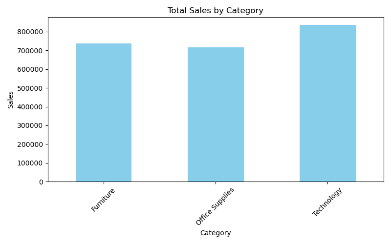
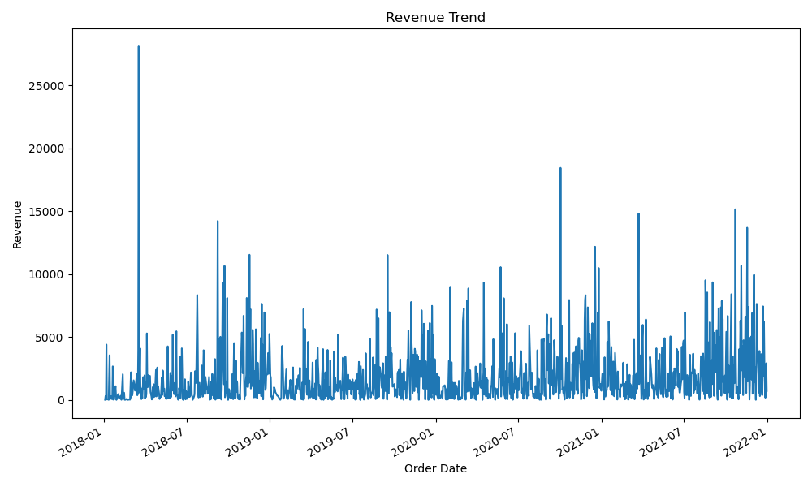
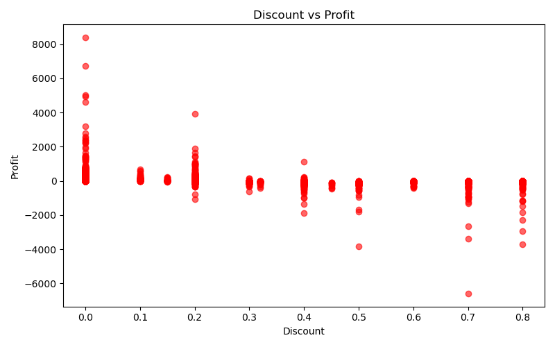
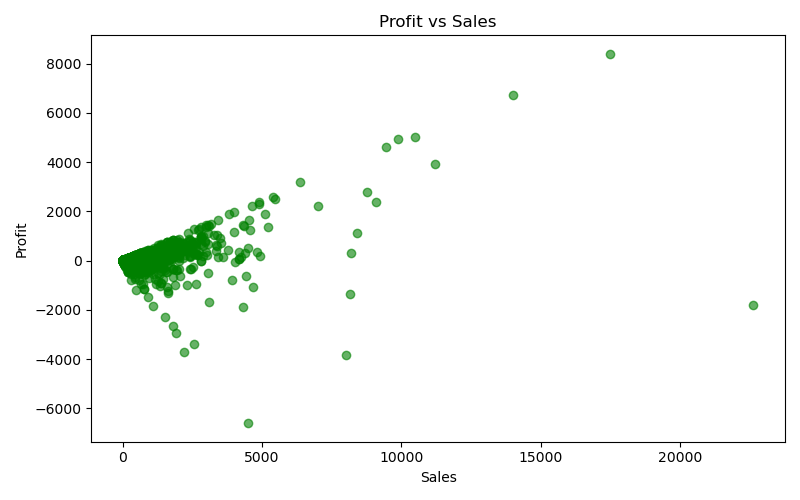
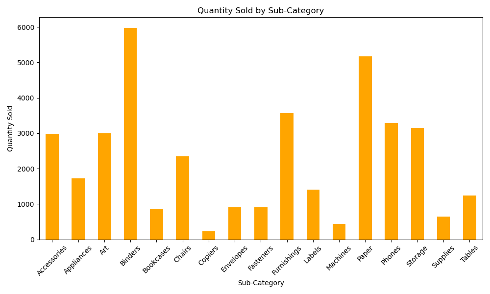

# CSV to MySQL Data Pipeline

## Project Overview
This project demonstrates a beginner-friendly ETL pipeline that reads sales data from a CSV file, cleans and transforms it using Python and Pandas, and loads the final dataset into a MySQL database.

The goal of this project is to show the core steps of a batch data pipeline:
- extracting raw data from a flat file
- transforming and validating the dataset
- loading clean records into a relational database

It is designed as a portfolio project for entry-level data engineering roles.

## Key Features
- Reads raw sales data from CSV files
- Cleans and standardizes column names
- Handles missing and invalid values
- Converts columns to the correct data types
- Loads cleaned data into MySQL
- Uses modular Python scripts for each ETL step
- Prints row-level insertion errors without stopping the full pipeline

## Tech Stack
- Python
- Pandas
- MySQL
- python-dotenv

## Pipeline Flow
```text
CSV File → Extract → Transform (Pandas) → Load (MySQL)
```
## Visualizations

### Sales by Category


### Revenue Trend


### discount_vs_profit


### profit_vs_sales


### quantity_by_subcategory


### sales_over_time


## Project Structure
```text
csv-mysql-data-pipeline/
├── data/                    # Raw and cleaned CSV files
│   ├── clean_sales_data.csv 
│   └── sales_data.csv
├── src/                     # Python scripts
│   ├── clean_data.py        # Data cleaning and transformation
│   ├── db_connection.py     # Database connection handler
│   ├── load_data.py         # Load cleaned data into MySQL
│   └── read_data.py         # Preview / inspect data
├── .env.example             # Example environment variables
├── .gitignore
├── requirements.txt         # Python dependencies
├── schema.sql               # SQL table schema
└── README.md
```

## ETL Steps

### 1. Extract
The pipeline reads raw sales data from a CSV file located in the `data/` folder.

### 2. Transform
The transformation step performs data cleaning operations such as:
- cleaning column names
- handling missing values
- converting date and numeric fields
- dropping invalid rows when needed

### 3. Load
The cleaned dataset is inserted into a MySQL table using Python.

## How to Run

### 1. Install dependencies
```bash
pip install -r requirements.txt
```

### 2. Create the MySQL table
Run the SQL script in `schema.sql` inside your MySQL database.

### 3. Create a `.env` file
Create a `.env` file based on `.env.example` and add your MySQL credentials.

Example:
```env
DB_HOST=localhost
DB_PORT=3306
DB_NAME=your_database_name
DB_USER=your_mysql_user
DB_PASSWORD=your_mysql_password
```

### 4. Run the cleaning step
```bash
python src/clean_data.py
```

### 5. Load data into MySQL
```bash
python src/load_data.py
```

### 6. Preview sample rows
```bash
python src/read_data.py
```

## Notes
- Handles day/month/year date formatting
- Drops invalid or incomplete rows automatically
- Keeps the ETL process modular and easy to understand
- Useful as a beginner portfolio project for ETL and data engineering fundamentals

## Example Use Case
This project simulates a real-world workflow where business sales data arrives as a CSV export and must be cleaned before being loaded into a database for reporting or analysis.

## Future Improvements
- Add logging
- Add data validation checks
- Add duplicate detection
- Add automated scheduling
- Add reporting or dashboard integration
